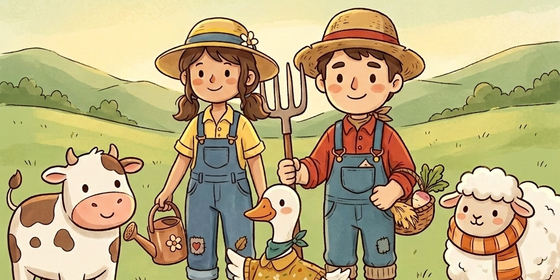

<p align="center">
  
</p>

<h1 align="center">Kaggriculture Agent</h1>

<p align="center">
  A rule-based farming agent for Kaggle's <a href="https://www.kaggle.com/competitions/kaggriculture"></a> <b>Kaggriculture</b> simulation competition.
</p>

<p align="center">
  <a href="https://www.kaggle.com/competitions/kaggriculture"></a>
  
  
  
</p>

---

## What this is

Two players each manage a farm for a 30-day season (720 turns), competing on a shared, dynamic market. This repo holds `main.py` — a single-file, stateless heuristic agent that plants, waters, harvests, and sells its way through the season.

**V1 scope: crops only.** Wheat, carrot, tomato, strawberry, melon. No animals yet (goose/cow/sheep, coops/pastures) — see [Roadmap](#roadmap).

## Status

| | |
|---|---|
| Current submission | `main.py` — V1 crops-only heuristic agent |
| Local result | beats `random` (~$13.5k vs $0) and `starter` ( ~$13.5k vs ~$3.5k) over 720 turns |
| Leaderboard | early — current score sits well behind the top teams (~600 vs ~2900–3100). V1 is a correctness-first baseline, not yet tuned for competitive economy. Tuning and animal support are next. |

## How the agent works

Every turn, `agent(obs)` runs a one-way pipeline — no state is carried between turns beyond what's re-derivable from the observation:

```
obs → task queue → unit assignment → dispatch → action dict
```

1. **Task queue** (`build_task_queue`) — scans the farm's tiles into a priority-ordered list: `WATER > HARVEST > DIG (weed) > FERTILIZE > PLANT`. Each tile yields at most one task.
2. **Assignment** (`assign_units`) — greedily pairs the farmer and any hired hands to tasks by `(priority, distance)`, so the highest-priority task in the whole queue is always claimed first, not just whatever's nearest to a given unit.
3. **Dispatch** (`dispatch_unit`, `step_toward`) — moves a unit one step toward its task's tile, or performs the task if already there.
4. **Rotation planning** (`rotation_plan`, `choose_plant_crop`) — a cash-gated three-phase crop mix: wheat/carrot early, melon once cash allows, tomato/strawberry once there's surplus. New `PLANT` tasks target whichever crop is furthest below its phase's target share.
5. **Market orders** — built independently each turn, capped at the game's 10-order limit, in priority order:
   - `seed_restock_orders` / `fertilizer_restock_order` — keep seed and fertilizer stock ahead of demand
   - `throttled_sell_orders` — caps units sold per resource per turn so a big harvest doesn't crash its own price; force-sells only when the shed is near its 100-item cap
   - `hire_orders` — hires a farm hand only when the task backlog justifies the `fib(n)`-scaling cost
   - `land_orders` — buys the next quadrant only once existing land is ~80% utilized

`agent()` itself is a thin wrapper: any exception anywhere in the pipeline falls back to `PASS` + no market orders, so a bug never costs a turn beyond the one it occurs on.

> **Why `agent()` is the very last thing defined in `main.py`:** `kaggle_environments` loads a file-based submission by taking the *last callable* in the module's namespace — not by looking for a function named `agent`. Every other function must be defined above it.

## Repo layout

```
main.py                 the whole agent — constants, planning, market logic, entrypoint
tests/                  52 tests covering every pure function + full-turn integration
scripts/local_eval.py   runs main.py against the "random" and "starter" baselines
scripts/probe_axis.py   one-off script that empirically determined the movement-direction mapping
docs/GAME_RULES.md       full game rules (crop/animal tables, market pricing, turn order)
AGENTS.md               Kaggle's getting-started guide (local testing, CLI submission)
```

## Running it

```bash
pip install -U kaggle-environments pytest

# unit + integration tests
pytest -v

# play against the baselines locally
python3 scripts/local_eval.py

# submit
kaggle competitions submit kaggriculture -f main.py -m "your message"
```

See [AGENTS.md](AGENTS.md) for the full Kaggle CLI workflow (credentials, checking submission status, pulling replays/logs).

## Roadmap

- [ ] Tune rotation-phase cash thresholds and sell throttling against real match data — the current values are reasonable defaults, not empirically optimized
- [ ] Add animals (goose/cow/sheep) — steady-state income once the crop loop is solid
- [ ] Land-expansion and hire-ROI tuning against actual opponents rather than the fixed baselines
